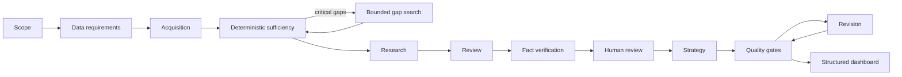

# Strategy Research Platform · Pipeline V2

An auditable, evidence-first workspace for turning a confirmed strategy scope into structured research, reviewed claims, a revision-controlled report, and a professional dashboard.

> Portfolio status: the deterministic Pipeline V2, Streamlit workspace, Fake Agent E2E, and React dashboard are implemented. Live research quality still depends on public-source availability and human review; the repository does not claim that a contract-level `PASS` proves every real-world fact.

## Why this project exists

Strategy reports often lose provenance between browsing, prose, spreadsheets, and slides. This platform keeps a canonical JSON chain from Source and Observation through Fact, Report Data, Quality, Revision, and Dashboard. Missing evidence produces an explicit gap or degraded visualization—not an invented number.

## Workflow



Pipeline V2 isolates Agent stages behind typed contracts. Parsers and stage gates validate canonical artifacts before downstream work continues; deterministic repair is bounded, while evidence gaps require a live rerun or human decision.

## Capabilities

- Analysis templates: competitor, market entry, industry, company, product, growth, business model, investment/M&A, and generic strategy.
- Data planning and acquisition: dataset-specific, industry-aware, multilingual query vocabularies with bounded Gap Search.
- Governance: Source Registry, canonical Observations, comparable groups, fact labels, Quality root causes, hashes, and immutable revisions.
- Workspace: Streamlit control plane for runs, coverage, human review, revisions, and dashboard launch.
- Dashboard: React + TypeScript + Vite + Apache ECharts, driven only by structured JSON; unsupported data is excluded and partial data is labelled.
- Offline verification: Fake Agents and deterministic fixtures require no `OPENAI_API_KEY` or paid search API.

## Stage responsibilities

| Stage | Responsibility |
|---|---|
| Research | Interpret acquired evidence and add bounded qualitative context. |
| Review | Produce atomic, sequential `R1…Rn` issues in canonical JSON. |
| Fact Verification | Link atomic claims to Observation and Source IDs with status and temporal semantics. |
| Human Review | Record explicit decisions without rewriting upstream evidence. |
| Strategy | Build recommendations and scenarios from approved structured inputs. |
| Quality | Enforce deterministic contracts, lineage, hash, and rendering readiness. |

## Data lineage and revisions

```text
Dashboard Metric → Report Data → Fact ID → Observation ID → Source ID → public URL/PDF + as_of_date
```

`rev_000` is the Initial Snapshot and is not counted as a user revision. Real revisions start at `rev_001`, record parentage and hashes, preserve unaffected stages, and invalidate downstream artifacts according to the revision type.

## Quick start · Windows PowerShell

```powershell
py -m venv .venv
.\.venv\Scripts\Activate.ps1
python -m pip install -r requirements.txt pytest
python -m streamlit run app.py
```

In another terminal:

```powershell
Set-Location dashboard-web
npm.cmd ci
npm.cmd run dev
```

The workspace defaults to `http://localhost:8501`; Vite defaults to `http://localhost:5173`.

## Offline demo and validation

```powershell
python scripts/run_v2_offline_e2e.py
python -m pytest -q
python -m tools.repository_check
python -m tools.audit_latest_run --run latest --revision latest --fix --offline --report

Set-Location dashboard-web
npm.cmd test
npm.cmd run build
```

The audit command discovers runs from parsed manifest timestamps, writes JSON and Markdown reports under `audit/`, never calls a live Agent, and never mutates original run artifacts.

## Example

A deliberately synthetic, sanitized fixture is available in [`examples/sample_run`](examples/sample_run). It demonstrates contracts and lineage without representing a real company or publishing local research outputs. Dashboard screenshots are added only after real browser viewport validation.

## Privacy, security, and limitations

- `outputs/`, local browser profiles, Streamlit secrets, generated dashboard data, and `.env` files are excluded from version control.
- Public-source acquisition must not bypass paywalls, login, CAPTCHA, robots restrictions, or access controls.
- A live Agent rerun can consume the user's Codex allowance and is never part of CI.
- Sparse or non-comparable evidence may produce `PARTIAL`, `BLOCKED_DATA`, or an Empty State.
- The latest local run may fail the stricter V2 audit even when the platform code is healthy; historical outputs remain immutable evidence.

## Documentation

- [中文说明](docs/README_zh.md)
- [Architecture](docs/architecture.md)
- [Pipeline V2](docs/pipeline-v2.md)
- [Data contracts](docs/data-contracts.md)
- [Quality gates](docs/quality-gates.md)
- [Revision model](docs/revision-model.md)
- [Dashboard design](docs/dashboard-design.md)
- [Local development](docs/local-development.md)
- [GitHub demo](docs/github-demo.md)
- [Quality and audit](docs/quality-and-audit.md)

## Roadmap

- Add more industry vocabularies and contract fixtures.
- Add opt-in live acquisition adapters while preserving the offline boundary.
- Publish browser-verified responsive screenshots and accessibility checks.
- Add a user-selected open-source license before public release.

No license has been chosen yet; all rights remain with the repository owner until one is added.
